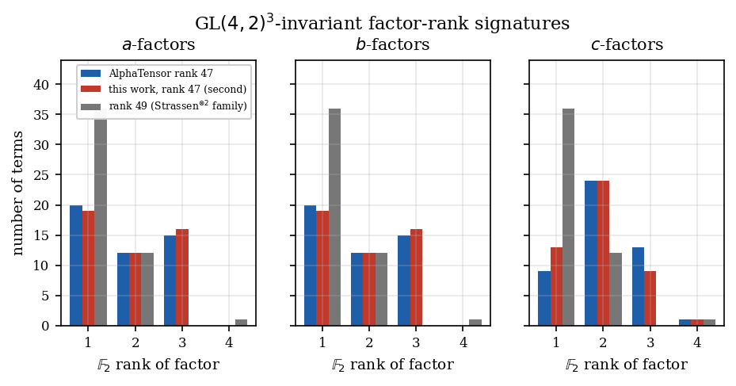
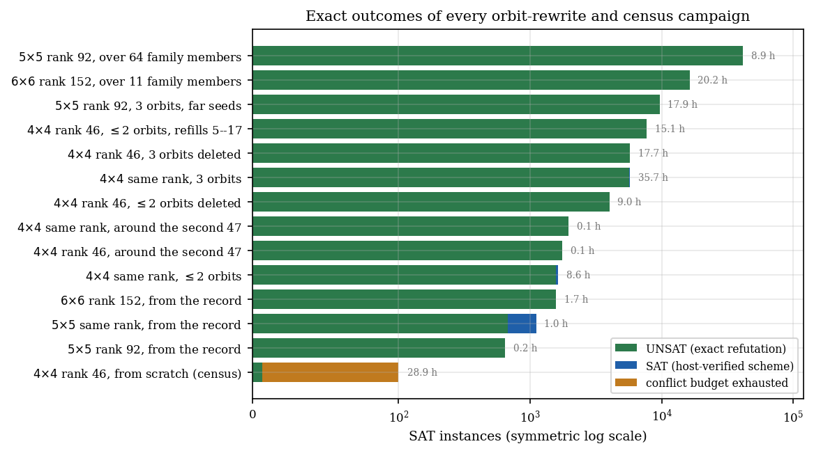

# Exact Symmetry-Stratified Search for Fast Matrix Multiplication over F₂

[](https://doi.org/10.5281/zenodo.22823114)
[](https://opensource.org/licenses/MIT)

An exact, symmetry-stratified search for bilinear matrix-multiplication schemes over the field with two
elements, run on one consumer laptop. Every scheme in this archive was accepted only after a direct check
of all *n*⁶ Brent equations, and every negative result is a solver refutation, never an exhausted budget.

**Headline result: a second, inequivalent rank-47 scheme for 4×4 matrix multiplication over F₂**, found
from scratch under the symmetry group of AlphaTensor's rank-47 factorization. It shares no term with
AlphaTensor's scheme, has a different GL(4,2)³-invariant factor-rank signature, and is therefore
inequivalent to it under every change of basis and slot symmetry. Both schemes are printed term by term
in the supplement and stored as JSON in `results/records/`.

## Scope

No published record is improved. The rank-46 question for 4×4 over F₂ remains open. Every refutation here
has the form *"no scheme of rank r that is invariant under group G and lies within this rewrite radius
exists"* — exact, but conditional on a symmetry assumption and local to a neighbourhood. Section 12 of
[main.pdf](main.pdf) states the scope of each class of result precisely, including which censuses are
partial and why undecided instances are never counted as negatives.

## Key results

| Result | Evidence | Status |
|---|---|---|
| **A second inequivalent 4×4 rank-47 scheme over F₂** | from-scratch SAT search under Γ, 2×10⁷ conflicts, 7,493 s; host-verified; 0 terms in common with AlphaTensor's; different factor-rank signature; not related by any of the 82,944 permutation/slot symmetries | verified |
| **The symmetry group of AlphaTensor's 47** | Γ = S₃ × ⟨τ⟩ of order 12; orbit sizes 12,6,6,6,6,3,3,3,1,1; stabilizer orders 1,2,2,2,2,4,4,4,12,12 | verified |
| **Both rank-47 schemes are locally rigid** | 28,835 decided orbit-rewrite instances: no Γ-invariant rank-46 scheme keeps 8+ of the 10 orbits of either, and no other Γ-invariant rank-47 scheme lies within the searched radius | exact |
| **Both are flip-isolated** | zero shared factors on all three axes, so no flip-graph move can act on them or on anything equivalent | verified |
| **Neither lifts to Z/4** | first Hensel level is an inconsistent F₂ system (4096 equations, 2256 unknowns, rank 2117); Strassen⊗Strassen passes the same test | exact |
| **Kronecker obstruction** | a Kronecker-rank-1 factor has matrix rank 1, 2 or 4, never 3; the 47 has 15/15/13 rank-3 factors, so in *every* basis it is far from a product scheme | exact |
| **Fixed-point restriction lemma** | Brent equations at involution-fixed coordinates close on involution-fixed terms; block-preserving involutions force a smaller-format scheme. 892 of 11,767 census instances refuted outright; 21,647 of the first 23,072 rank-46 orbit-type multisets | exact, validated 4 ways |
| **rank_F₂⟨2,2,2⟩ = 7** | rank ≤ 6 UNSAT in 35.9 s; rank ≤ 7 SAT and verified | exact |
| **Strassen is unique over F₂** | exactly 36 rank-7 term sets for ⟨2,2,2⟩, forming a single orbit under GL(2,2)³ × S₃ | exact |
| **307 distinct 5×5 rank-93 schemes** | breadth-first expansion of exact two-orbit same-rank rewrites, 140,359 instances over 125 fully expanded seeds; ≥ 272 pairwise-inequivalent classes; family not known to be finite | verified |
| **79 distinct 6×6 rank-153 schemes** | same method, 14,280 instances over 5 fully expanded seeds; ≥ 47 inequivalent classes | verified |
| **No rank-92 or rank-152 nearby** | 76,495 UNSAT instances across the two records and 77 further family members, no budget exhaustions | exact |
| **No rank-46 in any census run** | 23,072 of 47,210 Γ orbit-type multisets; 1,861 of 4,321 odd-order GL(4,2)³ instances; 452 diagonal-permutation instances | exact where decided, partial |

## Papers

- **Main paper:** [main.pdf](main.pdf) — problem setup, the two rank-47 schemes, the rigidity theorems,
  the fixed-point lemma, the 5×5 and 6×6 families, and an explicit scope section
- **Supplement:** [supplement.pdf](supplement.pdf) — both rank-47 schemes term by term, encoding
  details, full campaign tallies, census state, process findings, reproducibility

## Figures

| | |
|---|---|
|  |  |
| The two rank-47 schemes have different factor-rank signatures on every axis — the proof of inequivalence | Every exact campaign, coloured by outcome; green is a refutation |

## Installation

### Requirements
- **Python:** 3.9+
- **CPU:** the SAT work is CPU-bound; 12 cores were used here
- **GPU (optional):** NVIDIA with CUDA, only for the flip-graph walkers; no result in the papers depends on it

```bash
pip install -r requirements.txt
```

### Dependencies
```
python-sat>=0.1.8      # CaDiCaL 1.9.5 binding
numpy>=1.24.0
matplotlib>=3.7.0
cupy-cuda12x>=13.0.0   # optional, GPU walkers only
```

## Usage

All commands run from `experiments/`.

```bash
# Verify every headline count in the papers against results/ (21 checks, ~2 min)
python reproduce.py

# Recompute every number quoted in the papers, re-verifying each scheme (~10 min)
python paper_data.py

# Regenerate the seven publication figures (PDF + PNG) and the generated LaTeX tables
python paper_figures.py
python paper_tables.py

# Self-tests of the three pieces of machinery
python fp_filter.py --selftest      # fixed-point lemma, incl. exhaustive n=2 cross-check
python encode_opt.py --selftest     # E1+E2 encoding vs the unreduced encoder
python glsym.py --selftest          # general-linear symmetry encoder
```

Rebuild the papers from the project root:

```bash
pdflatex main.tex && pdflatex main.tex && pdflatex supplement.tex && pdflatex supplement.tex
```

### Resuming the unfinished censuses

Two censuses were checkpointed per instance and stopped when the machine was needed elsewhere. Their
frozen state is in `results/investigation_state.json`, and both resume from where they stopped:

```bash
python pool_runner.py --task gamma46_task --workers 4 --wall 300 --log ../results/G46_filter.jsonl --resume -- --max-slots 14 --filter-only --filter-conf 100000
python pool_runner.py --task glsym_task --workers 4 --wall 300 --log ../results/GL_odd.jsonl --resume -- --rank 46 --max-slots 8 --per-group 40 --conf 2000000
```

## Repository layout

```
.
├── README.md
├── LICENSE                       # MIT
├── CITATION.cff                  # machine-readable citation metadata
├── .zenodo.json                  # metadata for the Zenodo archive
├── requirements.txt
├── main.tex / main.pdf           # Paper
├── supplement.tex / supplement.pdf
├── tables_main.tex               # generated by experiments/paper_tables.py
├── tables_schemes.tex            # generated: both rank-47 schemes, term by term
├── paper_data.json               # generated: every number quoted in the papers
├── figures/                      # the seven publication figures (PDF + PNG)
├── experiments/                  # all code
│   ├── flip_graph.py             # the exact Brent verifier and CPU flip prototype
│   ├── symgroup.py               # symmetry generators, closures, orbits, stabilizers
│   ├── encode_opt.py             # E1+E2 orbit-level SAT encoder
│   ├── glsym.py                  # general-linear sandwich symmetry encoder
│   ├── fp_filter.py              # fixed-point restriction lemma as a filter
│   ├── orbit_lns_n.py            # orbit-level rewrites (reduce / same-rank)
│   ├── pool_runner.py            # work queue with a per-instance wall cap
│   ├── gpu_walker*.py            # CUDA flip-graph walkers
│   ├── paper_data.py             # recomputes every published number from results/
│   ├── paper_figures.py          # the seven figures
│   ├── paper_tables.py           # the generated LaTeX tables
│   └── reproduce.py              # 21-check reproduction script
└── results/                      # the evidence
    ├── records/                  # the record-rank schemes, incl. gamma47_B_rank47.json
    ├── *.json                    # every host-verified scheme found
    ├── *.jsonl                   # one record per SAT instance, every campaign
    ├── *_dissection.json         # per-campaign digests
    ├── certificates/             # DRAT proofs for a sample of refutations
    └── investigation_state.json  # frozen census tallies
```

Two categories of intermediate data are deliberately omitted: the solver stdout/stderr files, which are
process output rather than results, and about 80 MB of flip-graph walker pools holding thousands of
rank-49, rank-50 and rank-55 schemes, which the papers and the `*_dissection.json` digests summarise.
Everything the papers cite as evidence is here, and every command in the Usage section above runs from a
fresh clone. The one script that needs the walker pools is `experiments/h4_ancestors.py`, which
re-derives the retired steering hypothesis of the paper's Section 11; `report_figures.py` skips its pool
summary when they are absent. The Zenodo record archives this repository exactly, so the deposit and the
repository hold the same files.

## Data format

Every scheme is stored as JSON with the fields:

```json
{
  "format": [4, 4, 4],
  "rank": 47,
  "field": "F2",
  "verified_brent_f2": true,
  "scheme_bitmasks": [[a, b, c], ...]
}
```

Each factor is a 4×4 matrix over F₂ encoded as an integer: bit 4·i + j holds entry (i, j). The `a` factor
is indexed (i, j), the `b` factor (j, k) and the `c` factor (k, i).

## Reproducibility notes

- `experiments/reproduce.py` reports **21 checks, 0 mismatches** against the archived results.
- `experiments/paper_data.py` re-verifies every scheme it reports against the Brent equations and
  re-aggregates every campaign tally from the per-instance logs, so no number in the papers is
  transcribed from a narrative document.
- Two PySAT solver bindings were excluded on evidence during this work: Kissat 4.0.4 returned a wrong
  answer on a five-clause formula and then crashed, and CaDiCaL 3.0.0 crashed silently. All results use
  CaDiCaL 1.9.5.
- Two over-counts found during the campaign, both caused by blocking solutions at the assignment level
  rather than the set level, were corrected before publication and are documented in the supplement.

## Citation

Machine-readable metadata is in [`CITATION.cff`](CITATION.cff) and, for the Zenodo archive, in
[`.zenodo.json`](.zenodo.json). GitHub renders the first as a "Cite this repository" button. The DOI
above is the concept DOI and always resolves to the latest version; the version DOI for v1.0.0 is
[10.5281/zenodo.22823115](https://doi.org/10.5281/zenodo.22823115).


```bibtex
@misc{zaru2026fastmatrix,
  title     = {Exact Symmetry-Stratified Search for Fast Matrix Multiplication over F2:
               A Second Inequivalent Rank-47 Scheme for 4x4, Rigidity Theorems,
               and Large Same-Rank Families at 5x5 and 6x6},
  author    = {Zaru, Nadim F.},
  year      = {2026},
  doi       = {10.5281/zenodo.22823114},
  publisher = {Zenodo},
  url       = {https://doi.org/10.5281/zenodo.22823114}
}
```

## Prior work used

- AlphaTensor factorizations (Fawzi et al., *Nature* 610:47–53, 2022), imported and re-verified.
- The 5×5 rank-93 and 6×6 rank-153 schemes of Moosbauer and Poole (arXiv:2502.04514), obtained from the
  [Lille FMM database](https://fmm.univ-lille.fr), reduced mod 2 and re-verified.

## Author

**Nadim F. Zaru**
Independent Researcher
📧 nadimzaru@gmail.com

## License

MIT License — see [LICENSE](LICENSE).
